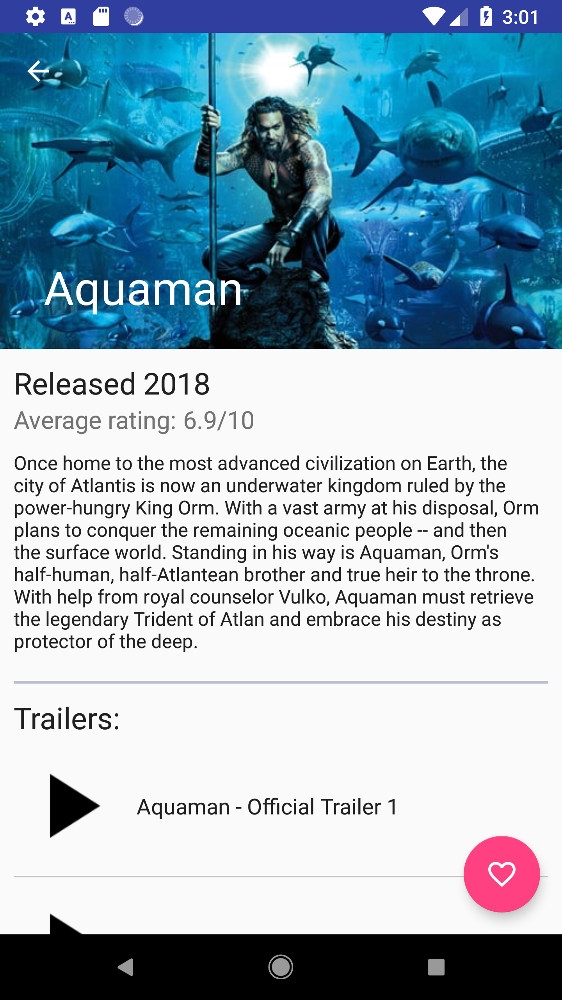
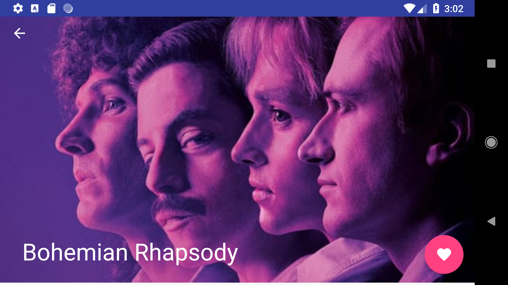

# Popular Movies App

This Android app allows users to explore and view information about popular movies. It was created as part of the Udacity Android Developer Nanodegree.

### Features

* See the most popular movies of all time or recently
* Watch movie trailers
* Read movie reviews submitted by other users
* Save movies as favorites
* Support for landscape and portrait mode

# Screenshots





# Developer Setup

## API Key

An API key from [The Movie Database](https://www.themoviedb.org/documentation/api?language=en-US) is required to run this app. Place. You must generate your own API key to run this app. Place the following in a gradle.properties file, which should be placed in the project root directory:

```API_KEY="your_api_key"```

# License

This app project is available under the [MIT LICENSE](https://github.com/fullmers/Popular_Movies/blob/master/LICENSE).
